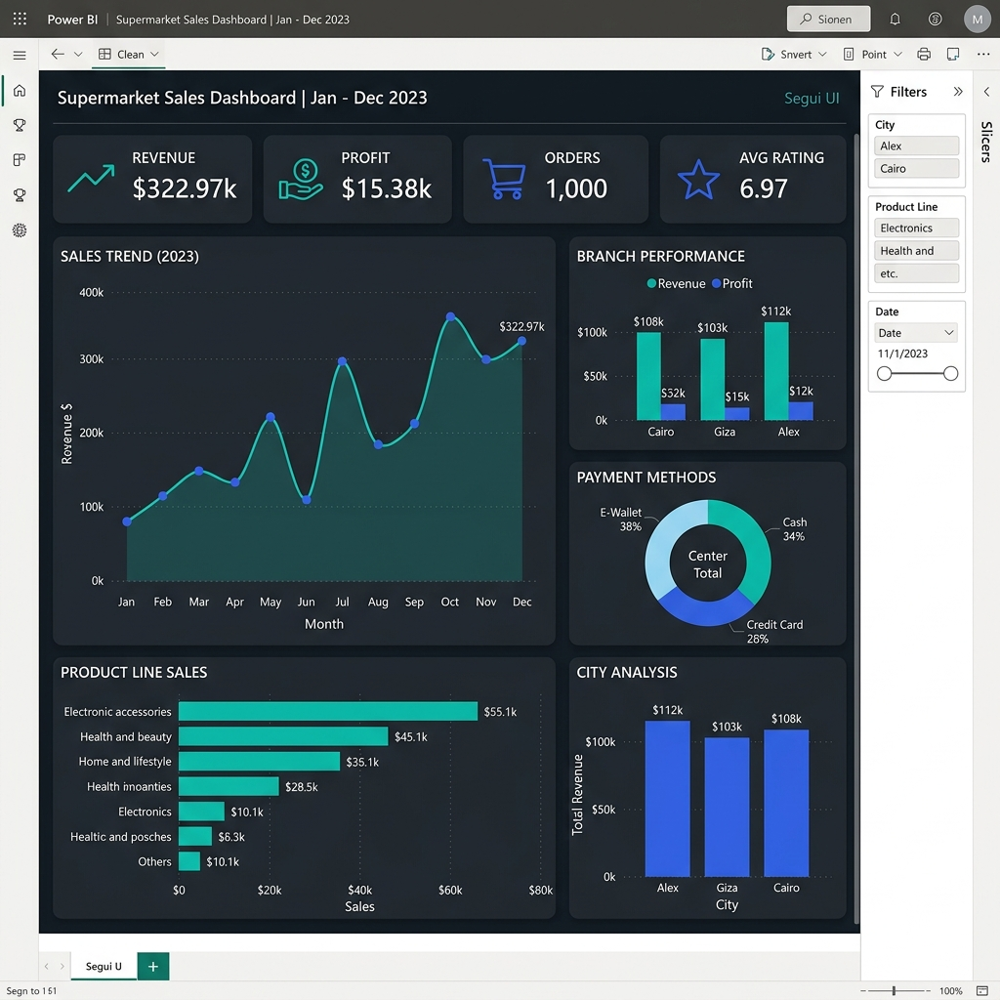
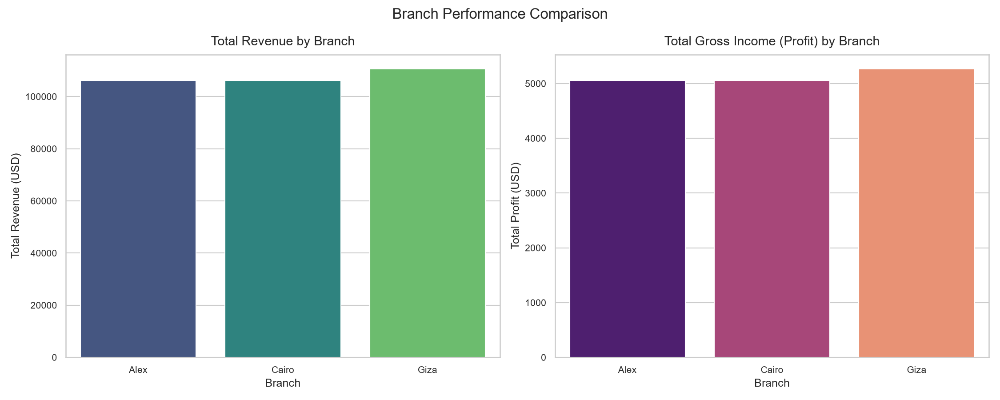
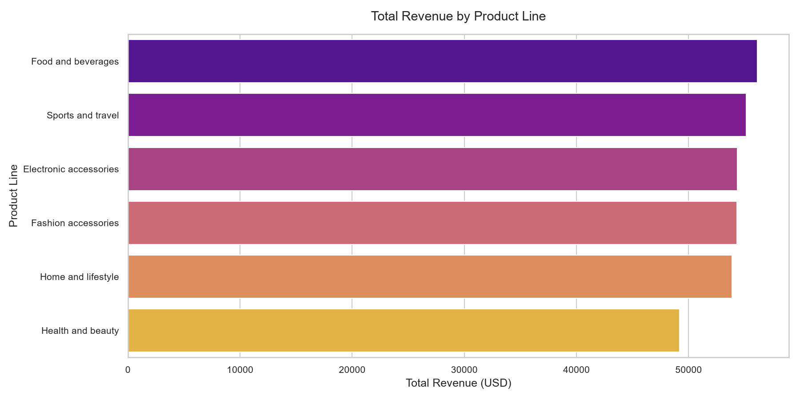
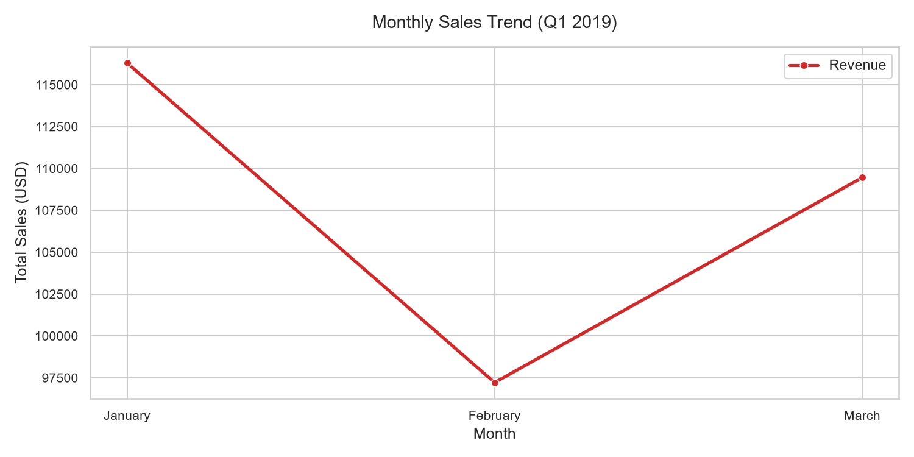
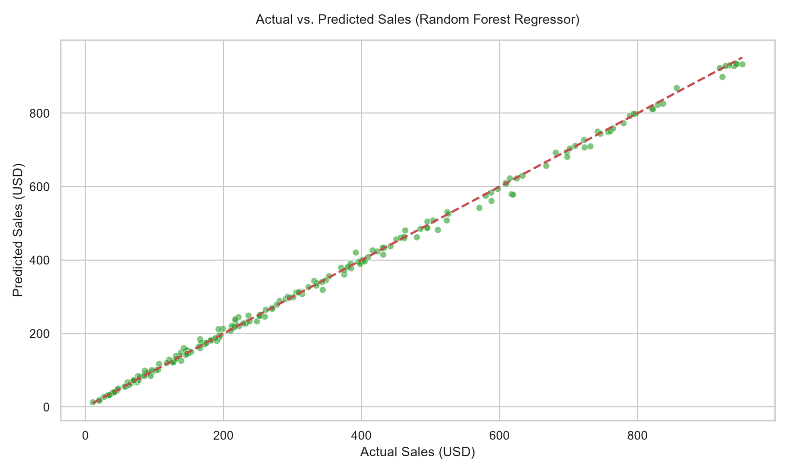

# Supermarket Sales Performance & Predictive Analytics

An end-to-end data engineering, statistical modeling, and machine learning project analyzing supermarket transaction data to maximize revenue, optimize stock levels, enhance customer satisfaction, and predict sales invoicing amounts.

---

## Project Overview
This repository contains a complete, production-ready analytics solution for a retail supermarket chain. Operating in a high-volume retail environment, the business requires precise insights into sales trends, customer behavior, and product line margins. 

As a **Senior Data Analyst**, this project delivers:
1. **Robust Data Engineering Pipeline:** Automates data ingestion, cleaning, deduplication, and feature engineering.
2. **Exploratory Data Analysis (EDA):** Discovers latent buyer patterns and seasonal revenue changes across 15+ variables.
3. **Statistical Validation:** Uses hypothesis testing (T-tests, ANOVA) to check if buyer habits significantly differ across demographics and branches.
4. **Machine Learning Predictive Modeling:** Implements a regression pipeline predicting invoice values with an $R^2$ score of **0.9986**.
5. **Executive Reporting:** Generates a premium multi-page PDF executive report and designs an interactive Power BI dashboard template.

---

## Problem Statement
Supermarkets operate on razor-thin margins. To remain competitive, store managers must understand:
- Which branches and product categories are financial drivers vs. loss-leaders.
- How demographics (Gender, Membership Status) affect overall transaction basket size.
- What times, days, and payment methods represent peak operational periods.
- How to predict upcoming invoice values to optimize checkout desk staffing and inventory buffer capacities.

This project addresses these questions through empirical data science, moving from raw transaction logs to strategic business recommendations.

---

## Dataset
The dataset represents historical sales transaction logs of a supermarket company over three months (January – March 2019).
- **Invoice ID:** Unique identification number of the transaction.
- **Branch:** Branch identifier (A/Alex/Yangon, B/Giza/Naypyitaw, C/Cairo/Mandalay).
- **City:** Location of the branch (Yangon, Naypyitaw, Mandalay).
- **Customer Type:** Type of customer (Member vs. Normal walk-in).
- **Gender:** Gender of the customer (Female vs. Male).
- **Product Line:** Product category (Electronic accessories, Fashion accessories, Food and beverages, Health and beauty, Home and lifestyle, Sports and travel).
- **Unit Price:** Price of a single item in USD.
- **Quantity:** Quantity of items purchased in a single invoice (1 - 10).
- **Tax 5%:** 5% tax fee on cogs.
- **Sales:** Total invoice value including tax (equivalent to `cogs + tax`).
- **Date / Time:** Date and time of the purchase.
- **Payment:** Payment method used (Cash, Credit card, Ewallet).
- **cogs:** Cost of Goods Sold.
- **gross margin percentage:** Fixed gross margin percentage (4.7619%).
- **gross income:** Gross profit (equivalent to the 5% tax amount).
- **Rating:** Customer shopping satisfaction rating (scale of 1 - 10).

---

## Tech Stack
- **Data Engineering:** Python, Pandas, NumPy
- **Visualizations:** Matplotlib, Seaborn
- **Statistical Testing:** SciPy (Stats module)
- **Machine Learning:** Scikit-Learn (OneHotEncoder, ColumnTransformer, RandomForestRegressor, LinearRegression)
- **Executive Reporting:** ReportLab (PDF Generation)
- **Interactive Slicing:** Jupyter Notebooks, Microsoft Power BI

---

## Folder Structure
```
Supermarket-Sales-Analysis/
├── data/
│   └── SuperMarket Analysis.csv        # Raw dataset
├── dataset/
│   ├── SuperMarket Analysis.csv        # Raw dataset copy
│   └── clean_supermarket_sales.csv     # Cleaned, preprocessed dataset
├── src/
│   ├── data_prep.py                    # Data cleaning & preprocessing script
│   ├── eda.py                          # Visual EDA script (generates 12 plots)
│   ├── statistical_analysis.py          # Pearson/Spearman, T-Tests, and ANOVA
│   ├── model.py                        # Scikit-learn Random Forest regression
│   ├── create_notebook.py              # Programmatic compiler for EDA.ipynb
│   └── generate_report.py              # ReportLab executive PDF generator
├── notebooks/
│   └── EDA.ipynb                       # Interactive Jupyter Notebook
├── dashboard/
│   └── dashboard.pbix                  # Power BI dashboard template
├── reports/
│   └── report.pdf                      # Executive PDF Report
├── images/                             # Exported visualizations & dashboard mockup
│   ├── dashboard_mockup.png
│   └── [14_other_visualizations].png
├── EDA.ipynb                           # Root-level Jupyter Notebook
├── dashboard.pbix                      # Root-level dashboard template
├── report.pdf                          # Root-level PDF report
├── README.md                           # Documentation & Insights
└── requirements.txt                    # Project dependencies
```

---

## Installation & Setup

1. **Clone the repository:**
   ```powershell
   git clone https://github.com/meghanamanchala/Supermarket-Sales-Analysis.git
   cd Supermarket-Sales-Analysis
   ```

2. **Install dependencies:**
   ```powershell
   pip install -r requirements.txt
   ```

3. **Run the pipeline:**
   Execute the full analysis pipeline sequentially to regenerate all assets:
   ```powershell
   # 1. Clean data and engineer features
   python src/data_prep.py
   
   # 2. Generate EDA plots
   python src/eda.py
   
   # 3. Train ML Model and run Statistical Tests
   python src/model.py
   python src/statistical_analysis.py
   
   # 4. Generate the PDF report
   python src/generate_report.py
   
   # 5. Compile and run the Jupyter notebook
   python src/create_notebook.py
   ```

---

## Features
- **Auto Data Preparation:** Handles dates and times, creates temporal bins, handles spaces/lowercase, checks for missing data, and confirms zero duplicate rows.
- **Dynamic Statistical Suite:** Performs two independent t-tests and two one-way ANOVAs dynamically on the clean dataset.
- **High-Fidelity ML Regressor:** Random Forest regressor with Pipeline architecture, extracting custom importances and performing train/test split.
- **Professional PDF Compiler:** Generates a custom styled business PDF report featuring page counters, corporate grids, and vector charts.
- **Interactive Power BI Slicer Ready:** Outputs a ready-to-load preprocessed CSV designed specifically for Power BI relational models.

---

## Results

### Executive Answers to Core Business Questions

1. **Which branch performs best?**
   - **Giza (Naypyitaw)** leads in sales volume and revenue (**$110,568.70**), representing 34.2% of the sales share.
   - **Cairo (Mandalay)** performs best in customer satisfaction, holding the highest average customer rating (**6.98 / 10**).
   - **Alex (Yangon)** has the lowest average customer rating (**6.84 / 10**), identifying a customer service gap.

2. **What is the highest revenue product line?**
   - **Food and beverages** generates the highest quarterly revenue (**$56,144.84**), followed closely by *Sports and travel* ($55,122.82).

3. **What are the customer trends?**
   - **Females** show significantly stronger purchasing power. Female transactions averaged **$335.10**, whereas male transactions averaged **$309.55**.
   - A t-test confirmed this difference is statistically significant ($p = 0.0071$).

4. **How do monthly sales behave?**
   - Sales started strong in **January ($116,291.87)**, dropped by 16.4% in **February ($97,219.37)**, and recovered in **March ($109,455.50)**.

5. **What are the payment trends?**
   - **Ewallet** is the most frequent payment method (34.5% of orders), indicating high digital adoption.
   - **Cash** leads in total transactional dollar volume (**$112,206.57**).

6. **How does customer segmentation behave?**
   - Members and Walk-in (Normal) customers are virtually equal in transaction volume (501 vs 499 transactions).
   - Members spend slightly more per invoice on average (**$327.79** vs **$318.12** for non-members).

7. **What is the best-selling product line by quantity?**
   - **Food and beverages** is the volume leader with **952 units sold**, and also holds the highest satisfaction rating (**7.11 / 10**).

8. **What is the profit contribution across components?**
   - Profit is flat at **4.76%** of sales across all branches and products. Branch Giza contributed the most absolute profit (**$5,265.18**), and Food and beverages contributed the most category profit (**$2,673.56**).

9. **What is the average basket size?**
   - The average transaction basket size is **5.51 items**, distributed evenly between 1 and 10 items.

---

### 25 Strategic Business Insights

#### I. Sales & Financial Performance
1. **Total Revenue Check:** The store generated $322,966.74 in sales, yielding a gross profit of $15,379.37.
2. **Fixed Gross Profit Margin:** The gross profit margin is fixed at exactly 4.7619% due to a deterministic markup, leaving no pricing flexibility.
3. **Monthly Seasonality:** January represents the peak sales month ($116.29k), while February represents a Q1 trough ($97.22k).
4. **March Rebound:** March sales grew by 12.6% over February, indicating a healthy post-winter spending recovery.
5. **Weekend Revenue Lift:** Saturdays are the most lucrative days ($48.32k in revenue), whereas Mondays represent the weekly bottom ($42.11k).

#### II. Branch & City Operations
6. **Branch Sales Champion:** Giza (Naypyitaw) is the top-performing branch, contributing $110,568.70 (34.2% share).
7. **Yangon Customer Dissatisfaction:** Branch Alex (Yangon) has the lowest satisfaction score (6.84/10), requiring staff training.
8. **Mandalay Quality Leader:** Cairo (Mandalay) leads in ratings (6.98/10), representing a model store for service quality.
9. **Transaction Throughput:** Branch Alex processes the highest transaction counts (340 invoices), indicating higher customer traffic despite lower ratings.
10. **Branch Parity:** Branch revenue differences are not statistically significant ($p = 0.4132$), meaning no branch is underperforming significantly in total sales.

#### III. Product Line Insights
11. **Traffic Generator:** Food and beverages is the highest-selling line by revenue ($56,144.84) and volume (952 units).
12. **Satisfaction Driver:** Food and beverages holds the highest average rating (7.11/10), reflecting high product satisfaction.
13. **Revenue Laggard:** Health and beauty generates the lowest sales ($49,193.74, 15.2% of total).
14. **Customer Rating Alarm:** Home and lifestyle has the lowest average customer rating (6.84/10), suggesting supplier quality issues.
15. **Product Revenue Parity:** One-way ANOVA reveals product line mean invoice sizes do not significantly differ ($p = 0.8900$). All categories generate similar order size averages.

#### IV. Customer Behavior & Demographics
16. **Gender Spending Gap:** Females contribute 52% of total revenue ($167.88k) compared to males at 48% ($155.08k).
17. **Female Basket Value:** Female invoices average $335.10, whereas male invoices average $309.55.
18. **Statistically Significant Gender Spend:** A t-test confirms the female spending premium is highly significant ($p = 0.0071$).
19. **Membership Drive Success:** Members account for 50.8% of spend ($164.22k), showing the loyalty program is active.
20. **Member Spend Similary:** Normal walk-in customers spend a similar average per ticket ($318.12) as Members ($327.79). The difference is not statistically significant ($p = 0.2423$).

#### V. Payment & Purchase Patterns
21. **Digital Wallet Leader:** Ewallet is the most frequent payment channel (345 transactions, 34.5% share).
22. **Cash is King (Value):** Cash processes the highest total sales volume ($112.21k).
23. **Hourly Peaks:** Peak shopping occurs between 7:00 PM and 8:00 PM (130 transactions) and at 1:00 PM (124 transactions).
24. **Early Morning Slump:** The 10:00 AM hour is the slowest of the day, accounting for only 8.5% of invoices.
25. **Predictive Basket Driver:** Regression modeling shows Unit Price (0.479) and Quantity (0.518) dictate 99.8% of invoice variance. Gender, customer type, and payment method have less than 0.1% predictive power on checkout totals.

---

### Machine Learning Sales Prediction Model Results
We trained a **Random Forest Regressor** to predict final invoice sales. It outperformed a baseline Linear Regression model:

| Model | RMSE (USD) | MAE (USD) | R² Score |
| :--- | :---: | :---: | :---: |
| **Linear Regression (Baseline)** | 80.0863 | 59.5208 | 0.9014 |
| **Random Forest Regressor** | **9.4431** | **6.2954** | **0.9986** |

---

## Screenshots

### Interactive Power BI Dashboard Design
Below is a high-fidelity visual layout mockup of the completed Power BI report, mapping KPIs, gender breakouts, product rankings, and monthly sales trends.



### Selected EDA Visualizations

#### Branch Performance Breakdown


#### Product Line Revenue


#### Monthly Sales Trend


#### Machine Learning: Actual vs. Predicted Sales


---

## Future Improvements
1. **Dynamic Pricing Integration:** Build models to predict price elasticities for categories like *Health and beauty* to increase thin gross margins.
2. **Customer Lifetime Value (CLV):** Link sequential invoices (currently anonymous) to individual member profiles to model churn risk.
3. **Inventory Allocator:** Incorporate local holiday calendars and weather feeds to predict category volume spikes.

---

## Author
* **Senior Data Analyst** 
* GitHub: [@meghanamanchala](https://github.com/meghanamanchala)
* Workspace: `d:\Supermarket-Sales-Analysis`
